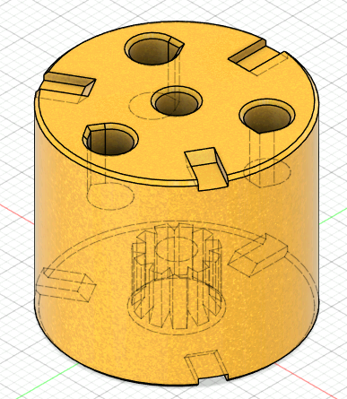
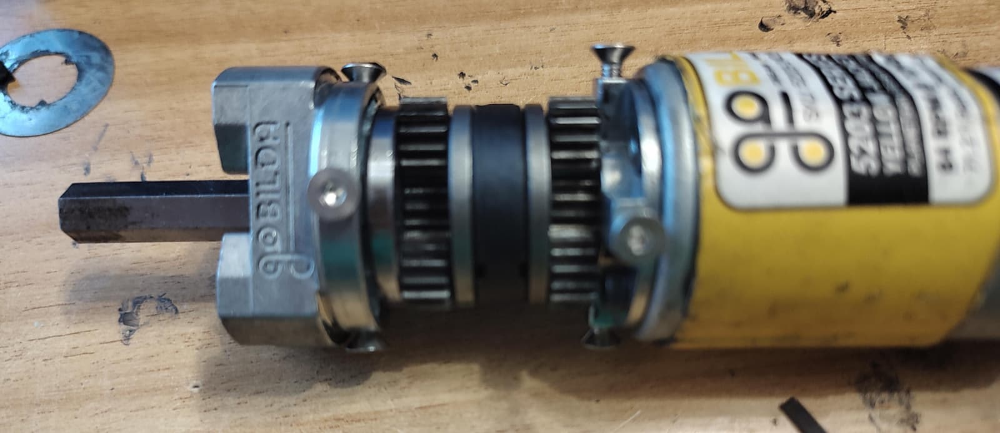
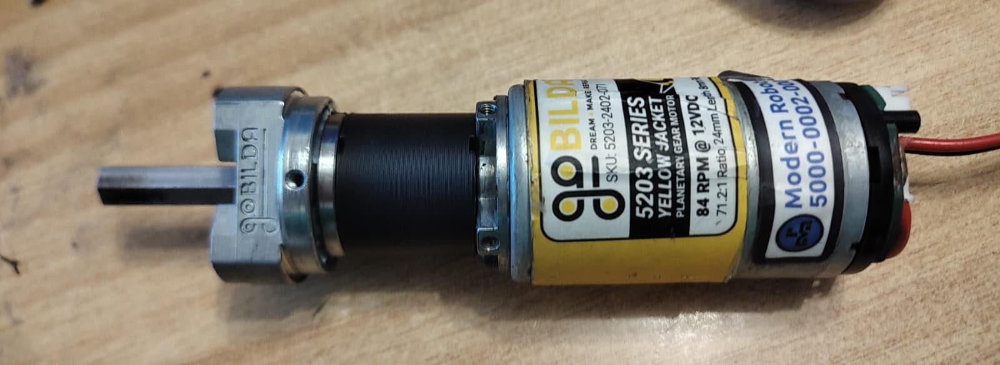

# Planetary Starkiller

Starkiller is a 3D printed file that allows a Gobilda Yellow Jacket 84 RPM motor to transform to any of the following speeds: 6000 RPM, 1620 RPM, 1150 RPM, 435 RPM, 312 RPM. It works by replacing parts of the planetary gearbox with fixed stages. 

The system also fits any other planetary gearbox from gobilda (not neccessarily the 84 RPM one) but we have selected the 84 RPM motor as the main focus because its planetary configuration can produce most of the other options.

The CAD is licensed under [GNU General Public License Version 3](https://www.gnu.org/licenses/gpl-3.0.en.html). This means, among others, that distributing either STL, printed parts or assemblies containing Starkiller, you must also make the modified CAD available to users. 

See more details about motor configurations, motor modding and printing guide on our [wiki page](https://wiki.teamclockworks.roimages/en/Projects/Starkiller).

## Example Configurations

| `SK11111` | `SK11717` | `SK21117` | `SK21711` | `SK31111` | `SK31717` |
| --- | --- | --- | --- | --- | --- |
|  |  |  |  |  |  |

| Conversion from 84 RPM to 435 RPM by replacing the center planetary with `SK11111` | Conversion from 84 RPM to 6000 RPM by replacing all the stages with `SK31717` |
| --- | --- |
|  |  |
