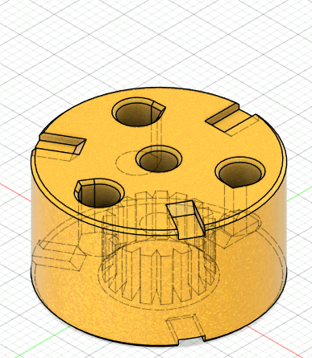
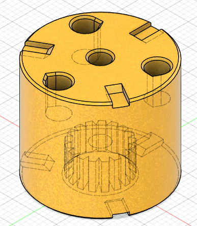

# Planetary Starkiller

Starkiller is a 3D printed file that allows a Gobilda Yellow Jacket 84 RPM motor to transform to any of the following speeds: 6000 RPM, 1620 RPM, 1150 RPM, 435 RPM, 312 RPM.

See more details on our [wiki page](https://wiki.teamclockworks.roimages/en/Projects/Starkiller).

## Example CAD configurations

| `SK11111` | `SK11717` | `SK21117` | `SK21711` | `SK31717` |
| -- |
|  |  |  |  |  |
